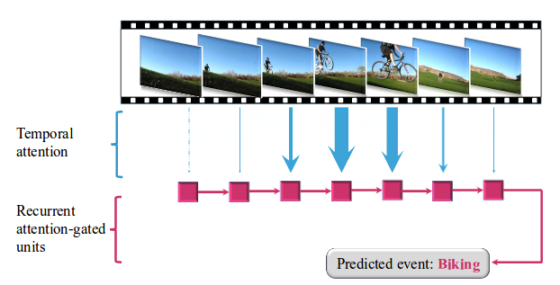

<br>

# Discontinued
I decided to discontinue the development of this code to concentrate my efforts on other projects.


# temporal-attention-violence-detection
Temporal Attention-Gated Model for violence classification. Given an input video, the model predicts if is violent or not. This repository is highly based on [Wenjie Pei](https://wenjiepei.github.io/) work, named [Temporal Attention-Gated Model for Robust Sequence Classification](https://github.com/wenjiepei/TAGM), which was accepted by CVPR 2017.


## Prerequisites
- Linux or macOS
- Python >=2.7
- Torch
- Lua
- Tensorflow
- Keras


### Dataset
- We use the [Violent-Flows](https://www.openu.ac.il/home/hassner/data/violentflows/) dataset to evaluate the model. The data set contains 246 videos, all videos were downloaded from YouTube. The shortest clip duration is 1.04 seconds, the longest clip is 6.52 seconds, and the average length of a video clip is 3.60 seconds.


## Running the code

### Preparing for training

- Download the dataset and put the folder **movies** into **data/**

If you choose to work with audio features, run this script:

```sh
th util/extract_mfccs.py
```

Otherwise, for visual features:

```sh
th util/extract_visual_feat.py
```

Creating the .t7 dataset
```sh
th create_t7.lua
```

### Running cross validation

```sh
th main.lua
```


## License

This project is licensed under the MIT License - see the [LICENSE.md](LICENSE.md) file for details

## References

* T. Hassner, Y. Itcher, and O. Kliper-Gross, Violent Flows: Real-Time Detection of Violent Crowd Behavior, 3rd IEEE International Workshop on Socially Intelligent Surveillance and Monitoring (SISM) at the IEEE Conf. on Computer Vision and Pattern Recognition (CVPR), Rhode Island, June 2012 .
